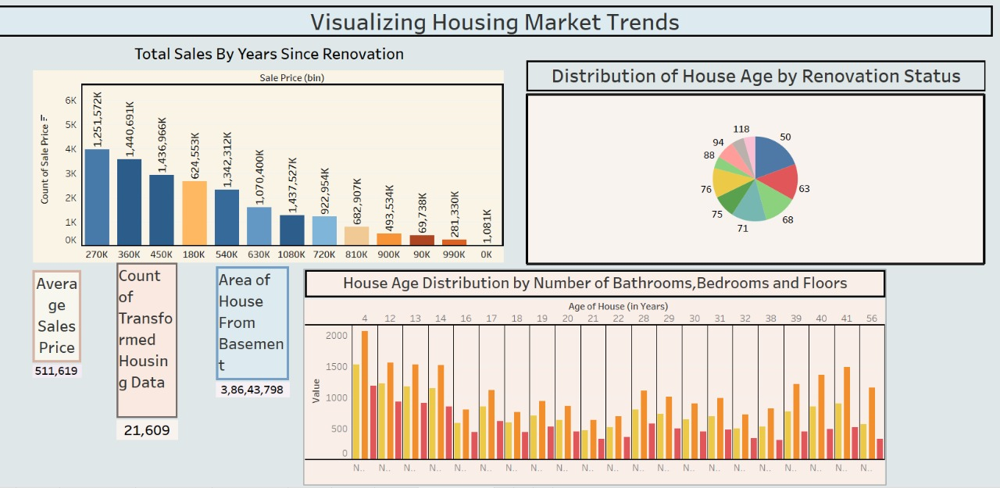
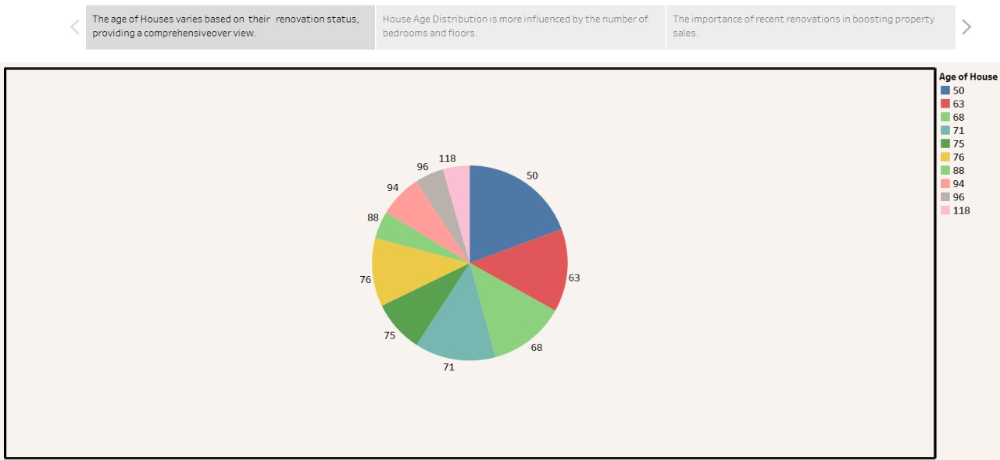
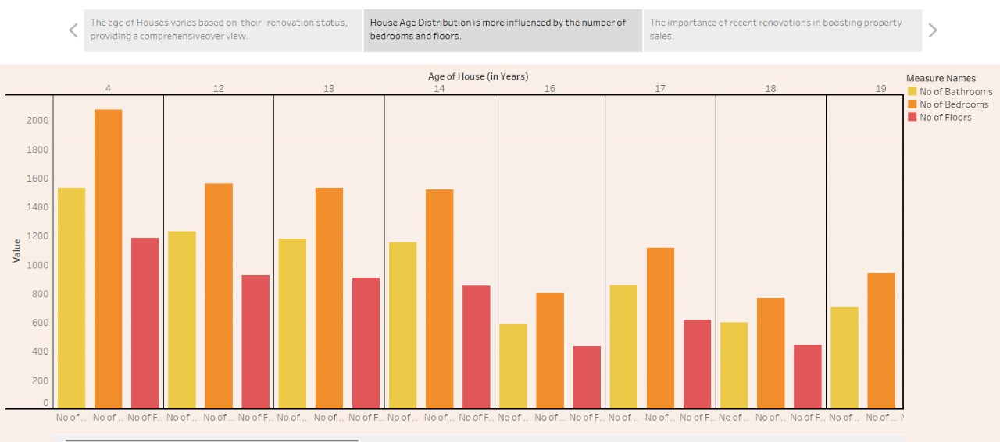
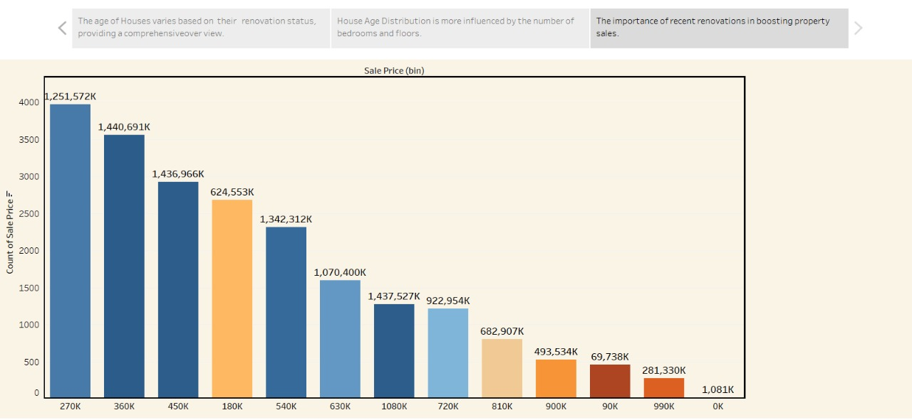

# 📊 Visualizing Housing Market Trends

🚀 Data Analytics Project  
📈 Analyzing housing price trends using visualization techniques
## 📌 Project Overview
This project focuses on analyzing housing market data to identify trends in prices, demand, and location-based variations. It uses data visualization techniques to present insights in an understandable format.
## 🎯 Objectives

- Analyze housing price trends  
- Identify high-demand locations  
- Understand market patterns  
- Create visual insights
## 📊 Dataset

- Source: (mention dataset source – Kaggle / CSV / etc.)  
- Data includes: price, location, area, bedrooms, etc.  
## 🛠️ Tools & Technologies

- Python  
- Pandas  
- NumPy  
- Matplotlib / Seaborn  
- Jupyter Notebook  
## 📈 Visualizations

- Price distribution  
- Location-wise price comparison  
- Trend analysis over time  
- Correlation heatmap
## ⚙️ Installation & Setup

git clone https://github.com/sailu167/housing-market-trends-analysis.git
cd housing-market-trends-analysis
pip install -r requirements.txt
## ▶️ How to Run
jupyter notebook
## 📤 Output

The project provides visual insights into housing market trends, helping users understand price variations and market behavior.
## Screen Shots
## 📌 Dashboard View

👉 This dashboard shows overall housing market trends including price distribution, location-wise analysis, and key insights.

### 📌 Story 1 – Price Analysis

👉 This visualization explains how house prices vary based on different factors such as area and location.
### 📌 Story 2 – Location Comparison

👉 This chart compares housing prices across different locations to identify high-demand areas.
### 📌 Story 3 – Market Trends

👉 This graph shows market trends over time, helping to understand price growth and patterns.
## 📊 Project Output

# 🔹 Images Folder Outputs

### 📌 Dashboard (Images Folder)

👉 This dashboard provides a clear overview of housing prices, trends, and key insights.

### 📌 Story 1 (Images Folder)

👉 This visualization explains price variations based on area and features.

# 🔹 ProjectImages Folder Outputs

### 📌 Dashboard (ProjectImages Folder)

👉 This dashboard shows detailed analysis of housing market trends.
### 📌 Story 1 (ProjectImages Folder)

👉 This chart highlights how house prices change based on different factors.

### 📌 Story 2 (ProjectImages Folder)

👉 This visualization compares house prices across multiple locations.

### 📌 Story 3 (ProjectImages Folder)

👉 This graph shows market trends over time and price growth patterns.

## 🌟 Key Highlights

Data-driven insights
Clear visualizations
Easy-to-understand analysis

## 📌 Conclusion

The project successfully identifies housing trends and provides meaningful insights using data visualization techniques.

  
